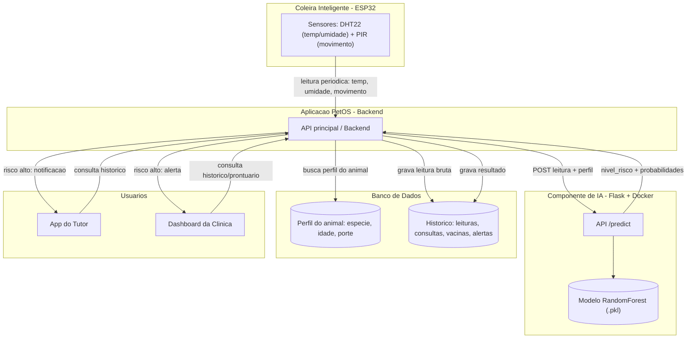

# Documentação do Componente de Inteligência Artificial — PetOS

## 1. Problema de Negócio

A coleira IoT do PetOS (ESP32 + DHT22 + PIR) hoje opera com **limiares fixos**: se a temperatura ultrapassa 35°C ou a umidade sai de uma faixa pré-definida, o sistema dispara um alerta genérico — igual para qualquer animal.

Isso gera três limitações dentro da jornada contínua de cuidado do pet:

1. **Falta de personalização fisiológica.** Um filhote, um idoso e um animal em reabilitação (ex: uma ave em reabilitação) têm faixas normais de temperatura, umidade e atividade diferentes entre si. Um limiar único gera tanto falsos alarmes quanto alertas tardios.
2. **Ausência de priorização.** O tutor recebe "atenção necessária" sem saber a gravidade real nem qual ação tomar.
3. **Nenhum aprendizado a partir do histórico.** O sistema não evolui com os dados do próprio animal, nem cruza a leitura do sensor com informações já registradas (idade, espécie, histórico clínico).

**Problema definido:** *Como transformar o monitoramento reativo e genérico (baseado em limiares fixos) em um monitoramento preventivo, personalizado por animal e priorizado por nível de risco, apoiando tutor e clínica na tomada de decisão?*

## 2. Abordagem de IA Escolhida

**Modelo preditivo de classificação (Random Forest)**, com uma camada de regras leve sobre a saída para traduzir o risco em ação.

### Por que não outras abordagens

| Abordagem | Por que não foi escolhida como núcleo do projeto |
|---|---|
| IA Generativa / LLM | Não resolve um problema de classificação de sinais vitais; adicionaria complexidade sem ganho direto para o problema definido. Fica como possível extensão futura (ex: chatbot de orientação ao tutor). |
| Sistema de recomendação | Seria útil para sugerir serviços da clínica, mas é um problema de dados e escopo diferente (histórico de consumo/serviços), não o problema central identificado. |
| NLP | Não há dado textual relevante nesta fase (a coleira gera dados numéricos de sensores). |
| Motor de regras puro (sem aprendizado) | É exatamente a limitação do sistema atual — não personaliza nem generaliza para casos não previstos manualmente. |

### Por que Random Forest

- Lida bem com **features mistas** (categóricas: espécie/porte/idade; numéricas: temperatura/umidade/atividade) sem exigir normalização.
- É **robusto a relações não-lineares**: tanto temperatura muito alta quanto muito baixa indicam risco — uma relação em "U", que um modelo linear simples não capturaria bem.
- Fornece **importância de features nativamente**, permitindo explicar por que o modelo decidiu determinado risco — relevante em decisões que envolvem saúde.
- Exige **menos volume de dado** que redes neurais, adequado ao estágio atual do produto (dataset ainda sintético/inicial).
- **Explicável para não-especialistas** (tutores e equipe da clínica), diferente de modelos de caixa-preta mais complexos.

## 3. Papel da IA na Personalização e Priorização

O modelo recebe, além da leitura do sensor, o **perfil do animal** (espécie, porte, idade), e por isso:

- **Personaliza o limiar de risco por espécie.** As faixas fisiológicas de referência (temperatura, umidade, atividade) são diferentes para cão, gato e ave — o mesmo valor de temperatura pode ser normal para uma espécie e crítico para outra.
- **Personaliza por idade.** Filhotes e idosos têm menor reserva fisiológica; o modelo aplica um fator de sensibilidade maior para essas faixas etárias.
- **Prioriza por nível de risco**, não apenas por "alerta sim/não": a saída é `normal`, `atencao` ou `critico`, com probabilidade associada — permitindo que o backend decida a urgência da notificação (push imediato ao tutor vs. registro para acompanhamento).
- **Apoia a tomada de decisão da clínica**, ao alimentar o histórico do animal com uma série temporal de níveis de risco, não apenas leituras brutas — facilitando identificar tendências antes da consulta presencial.

## 4. Dados Utilizados

| Dado | Origem | Estrutura | Uso pela IA |
|---|---|---|---|
| Temperatura | Sensor DHT22 (coleira) | Numérico (°C), leitura periódica | Feature de entrada do modelo |
| Umidade | Sensor DHT22 (coleira) | Numérico (%), leitura periódica | Feature de entrada do modelo |
| Atividade / movimento | Sensor PIR (coleira) | Numérico (% de tempo ativo em uma janela) | Feature de entrada do modelo |
| Espécie | Cadastro do animal no app | Categórico (cão / gato / ave) | Define as faixas de referência fisiológica usadas na personalização |
| Porte | Cadastro do animal no app | Categórico (pequeno / médio / grande / único) | Feature de entrada; matiza a interpretação de peso/porte |
| Idade / faixa etária | Cadastro do animal no app | Categórico (filhote / adulto / idoso) | Ajusta a sensibilidade dos limiares (personalização) |
| Histórico de leituras e riscos | Banco de dados da aplicação | Série temporal | Acompanhamento de tendência, insumo para retreino futuro |
| Histórico clínico, vacinas, consultas, medicamentos | Banco de dados da aplicação | Estruturado, associado ao ID do animal | Não utilizado no modelo atual (v1); previsto para versões futuras como contexto adicional de risco |

> **Nota sobre a origem dos dados de treino (v1):** como não existe um dataset público que combine sensores IoT + espécie + rótulo de risco veterinário, o modelo desta primeira versão foi treinado com um **dataset sintético gerado de forma documentada e reprodutível** a partir de faixas fisiológicas de referência por espécie (ver `notebook/modelo_risco_petos.ipynb`, seção 1). Este é um ponto explícito de transparência do projeto: a acurácia reportada reflete a consistência interna das regras de geração, não uma validação clínica real. A evolução natural é o retreino com dados reais rotulados por veterinários, à medida que o produto é usado.

## 5. Arquitetura de Integração

### Fluxo passo a passo

1. A coleira envia periodicamente as leituras de temperatura, umidade e movimento para o backend da aplicação.
2. O backend grava a leitura bruta no banco de dados e busca o perfil do animal (espécie, porte, idade) já cadastrado.
3. O backend faz uma requisição `POST /predict` para a API de IA, enviando a leitura + o perfil.
4. A API de IA (Flask, containerizada em Docker) carrega o modelo `.pkl` e retorna o `nivel_risco` e as probabilidades por classe.
5. O backend grava o resultado no histórico do animal.
6. Se o risco for `critico` (ou `atencao` de forma recorrente), o backend notifica o tutor pelo app e sinaliza a clínica no dashboard.
7. Tutor e clínica podem consultar o histórico de risco a qualquer momento pelo backend.

Esse desenho mantém a **API de IA desacoplada** do backend principal — ela pode ser atualizada, retreinada ou até substituída por outra abordagem no futuro sem alterar o restante da aplicação, desde que o contrato do endpoint `/predict` seja mantido.

## 6. Limitações Conhecidas e Próximos Passos

- Modelo treinado com dados **sintéticos**, não validado clinicamente — não substitui avaliação veterinária.
- Réptil silvestre fora do escopo do modelo atual: por serem ectotérmicos (não regulam a própria temperatura corporal), exigem uma lógica de referência diferente (dependente da temperatura do ambiente/terrário).
- Próxima versão prevista: incorporar histórico clínico/vacinas como features adicionais, retreinar com dados reais de uso, e avaliar um modelo específico para répteis.
